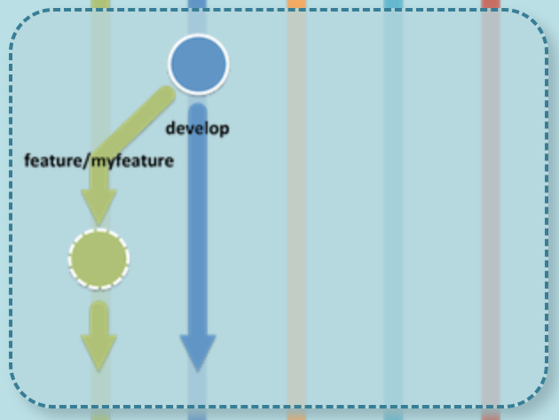
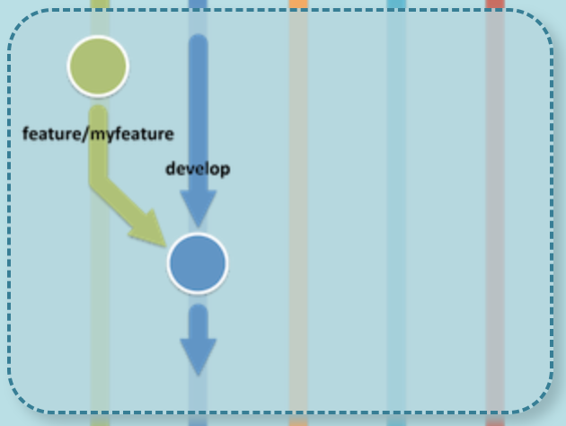

# Projet-DevOps

## git flow

Branch for production releases: main
Branch for 'next release' development: develop
Branch for features: feature/

Create a feature branch named 'feature/SCV'

Branch protection rule:
- Require a pull request before merging on 'main' branch

*git flow steps*:
- Create a feature branch from 'develop' branch named 'feature/*'

- Checkout to this new branch and commit on it
- Finish up a feature :
  - Merges it into 'develop'
  - Removes the feature branch
  - Switches back to 'develop' branch

Create a pull request for 'develop' on GitHub
- Merges 'develop' branch to 'main' branch