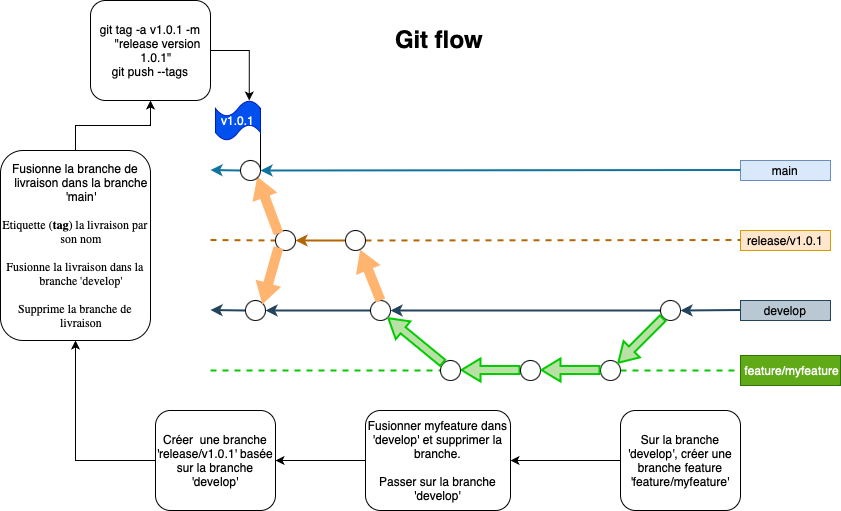

# Projet-DevOps

## git flow

Branch for production releases: main
Branch for 'next release' development: develop
Branch for features: feature/*
Branch for releases: release/vX.X.X

Branch protection rule:
- Require a pull request before merging on 'main' branch

*git flow steps*:
- Create a feature branch from 'develop' branch named 'feature/*'
- Checkout to this new branch and commit on it
- Finish up a feature :
  - Merges it into 'develop'
  - Removes the feature branch
  - Switches back to 'develop' branch

- Switched to a new branch 'release/v1.0.1'
- Finish up a release:
  - Tags it with its name
  - Create a pull request for 'release/v1.0.1' on Github to merge this branch into 'main' branch
  - Back-merges the release into 'develop'
  - Removes the release branch

